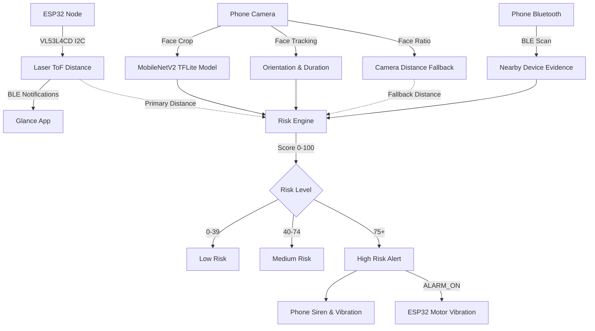

# Glance — Smart Glasses Detection & Safety

> See Smart. Stay Safe.

Glance is a prototype safety application that combines camera-based smart-glasses detection with Bluetooth scanning, distance sensing, and contextual information. Instead of relying on a single visual prediction, it combines several available inputs to estimate whether an interaction deserves attention.

The app connects over Bluetooth Low Energy (BLE) to an ESP32-based wearable hardware node equipped with a VL53L4CD Time-of-Flight (ToF) distance sensor and a small vibration motor for physical alerts.

---

## 1. What Problem Does Glance Solve?

Smart glasses are becoming more common and look very similar to standard prescription eyewear or sunglasses. From a phone camera alone, distinguishing smart glasses from regular glasses is difficult.

A single visual model prediction can easily make mistakes because of:
* Poor or uneven lighting
* Viewing angles and head tilt
* Distance from the camera
* Thick designer frames that look like smart glasses
* Camera resolution and motion blur

Because smart glasses often broadcast Bluetooth signals and encounters become more relevant at close range, Glance combines the camera model with Bluetooth device detection, physical distance measurements, and interaction context instead of treating the visual classifier as the final answer.

---

## 2. How Glance Works

Glance processes multiple inputs in parallel to calculate a single situational risk score:



1. **Vision**: The phone camera runs face detection via Google ML Kit, crops the face region, and passes it to an on-device TensorFlow Lite model.
2. **Distance**: The ESP32 reads physical distance from the VL53L4CD sensor and sends it to the phone over BLE at ~10 Hz. If the ESP32 is not connected, the app estimates distance from the camera face size as a fallback.
3. **Bluetooth**: The phone scans for nearby BLE devices and beacons, using signal strength (RSSI) to estimate proximity.
4. **Context**: The app tracks how long the person has been facing the user and whether their head is turned directly toward the camera.
5. **Risk Engine**: All signals are weighted into a risk score from 0 to 100. If the score reaches 75 or higher (High Risk), both the phone and the ESP32 trigger synchronized alarms.

---

## 3. Main Features

* **Real-time camera monitoring**: Live camera preview with bounding box and telemetry overlay.
* **Person & face detection**: Tracks head orientation (yaw/pitch) and interaction duration.
* **Smart-glasses visual classification**: On-device MobileNetV2 classifier running in TensorFlow Lite.
* **BLE device scanning**: Background scanning for nearby smart devices and beacons with RSSI tracking.
* **ESP32 hardware integration**: Auto-connects over BLE to stream distance and receive alert commands.
* **VL53L4CD distance measurement**: Millimeter-level Time-of-Flight laser ranging up to ~4 meters.
* **Camera distance fallback**: Automatically estimates distance from face proportions if the hardware sensor is unavailable.
* **Multi-factor risk calculation**: Combines distance, duration, orientation, visual probability, movement, and BLE signals.
* **Phone vibration and audio alert**: Audible siren and haptic alert when High Risk is triggered.
* **ESP32 vibration feedback**: Physical haptic pulsing on the wearable node synchronized with the phone.
* **Automatic BLE reconnection**: Reconnects to the ESP32 if the signal drops.
* **Simulation mode**: Interactive sandbox to test risk score calculation with manual inputs.
* **Safety event logs**: In-app timeline of risk state changes and alarms.

---

## 4. AI Model

The visual classifier runs locally on the phone using TensorFlow Lite:

* **Base architecture**: MobileNetV2 (pretrained on ImageNet)
* **Custom head**: GlobalAveragePooling2D → Dropout(0.35) → Dense(64, ReLU) → Dropout(0.25) → Dense(1, Sigmoid)
* **Input size**: 224 × 224 × 3 (RGB, normalized to `[-1.0, 1.0]`)
* **Model file**: `assets/smart_glasses_v2.tflite` (2.58 MB)
* **Inference**: On-device (runs in ~25–40 ms on modern Android devices)
* **Visual classification threshold**: **30% (0.30)**

$$\begin{aligned}
\text{Model Probability} < 0.30 &\longrightarrow \text{CLEAR} \\
\text{Model Probability} \ge 0.30 &\longrightarrow \text{GLASSES DETECTED}
\end{aligned}$$

### Why a 30% Threshold?

The visual classification threshold is intentionally set to 30% to give high recall (catching more potential smart-glasses cases). Because a positive visual prediction only adds up to 20 points to the risk engine, a 30% visual detection **cannot** trigger an emergency alarm on its own. The overall system High Risk alert requires a combined score of **75% or higher**, which needs corroborating evidence such as close distance, direct orientation, and sustained interaction.

---

## 5. Model Evaluation

The model was evaluated on a held-out test dataset of images collected and organized for this project:

### Dataset

* **Total images**: 403
  * **Positive (Smart Glasses)**: 153
  * **Negative (Regular Glasses / No Glasses)**: 250
    * Regular glasses: 150
    * Without glasses: 100
* **Split**: 70% Train (281), 15% Validation (61), 15% Held-Out Test (61)

### Test Results (Threshold = 0.30)

| Metric | Result |
| :--- | :---: |
| **Accuracy** | 78.69% |
| **Precision** | 66.67% |
| **Recall** | 86.96% |
| **F1 Score** | 75.47% |
| **ROC-AUC** | 86.96% |

### Confusion Matrix ($N = 61$)

| | Predicted Clear | Predicted Glasses |
| :--- | :---: | :---: |
| **Actual Regular / No Glasses (38)** | **TN = 28** | FP = 10 |
| **Actual Smart Glasses (23)** | FN = 3 | **TP = 20** |

20 of the 23 smart-glasses samples in the held-out test set were correctly detected. The model is intended as one input to the overall system rather than a standalone decision-maker. The relatively high recall at the selected threshold is useful because possible detections can be verified against distance, BLE, and other contextual signals.

---

## 6. Multi-Factor Risk Engine

The risk engine scores an interaction from 0 to 100 based on 6 factors:

| Factor | Max Points | How It Is Evaluated |
| :--- | :---: | :--- |
| **1. Distance** | **25 pts** | Active below 2.0 m: `10 + 15 * ((2.0 - dist) / 1.5)`. Uses ESP32 ToF primary, camera fallback. |
| **2. Interaction Duration** | **15 pts** | Awarded when continuous interaction reaches 5.0 seconds or longer. |
| **3. Face Orientation** | **15 pts** | Based on Euler Y/Z angles facing directly toward the camera (`orientation * 0.15`). |
| **4. Visual Model** | **20 pts** | Proportional to raw model probability (`probability * 0.20`). |
| **5. Movement** | **10 pts** | Awarded when facial movement is low (< 8 px), indicating focused observation. |
| **6. BLE Signal** | **15 pts** | Based on RSSI of nearby detected devices: `clamp((RSSI + 90) / 50 * 15, 2.0, 15.0)`. |

### Risk Categories

* **LOW RISK (0–39%)**: Normal ambient situation.
* **MEDIUM RISK (40–74%)**: Some indicators present (e.g., visual similarity or moderate distance), but insufficient combined evidence.
* **HIGH RISK (75–100%)**: Multiple strong indicators occur simultaneously (e.g., very close distance + direct orientation + visual detection + BLE signal). **Triggers the alarm system.**

---

## 7. Hardware

The hardware node is built with standard prototype components:

* **ESP32 Dev Module** (ESP32-WROOM-32)
* **STMicroelectronics VL53L4CD** Time-of-Flight sensor (I2C)
* **3V Micro Vibration Motor**
* **2N2222 NPN Transistor** (motor driver)
* **1N4007 Diode** (flyback protection across motor terminals)
* **1 kΩ Resistor** (between ESP32 GPIO 4 and transistor base)

### Pin Configuration

| Component Pin | ESP32 Pin | Function |
| :--- | :--- | :--- |
| **VL53L4CD SDA** | GPIO 21 | I2C Data (400 kHz Fast Mode) |
| **VL53L4CD SCL** | GPIO 22 | I2C Clock |
| **VL53L4CD VIN** | 3.3V | Power |
| **VL53L4CD GND** | GND | Ground |
| **Motor Driver Base** | GPIO 4 | Digital output for motor control |

---

## 8. ESP32 + BLE

The ESP32 runs a BLE GATT server that advertises as `Glance-ESP32`.

### GATT Configuration

| Service / Characteristic | UUID | Properties | Purpose |
| :--- | :--- | :--- | :--- |
| **Glance Service** | `4fafc201-1fb5-459e-8fcc-c5c9c331914b` | — | Main GATT service |
| **Distance Characteristic** | `beb5483e-36e1-4688-b7f5-ea07361b26a8` | Read, Notify | Streams 3-byte distance packets (~10 Hz) |
| **Command Characteristic** | `1c95d5e3-d8f7-413a-bf3d-7a2e5d7be87e` | Write, WriteNR | Receives control commands from phone |

### Control Commands

* **`ALARM_ON`**: Starts a non-blocking 300 ms ON / 300 ms OFF vibration pattern on GPIO 4.
* **`ALARM_OFF`**: Immediately stops the vibration motor and resets GPIO 4 to LOW.
* **`MOTOR_TEST`**: Pulses the motor for 2 seconds to verify wiring.

---

## 9. Distance Measurement

Glance supports two distance sources:

1. **Primary (VL53L4CD ToF Sensor)**: Directly measures physical distance using laser Time-of-Flight. It provides millimeter-accurate readings up to ~4 meters and is unaffected by camera zoom or facial crop angles.
2. **Fallback (Camera Estimation)**: If the ESP32 is not connected or returns an invalid reading, the app estimates distance based on the detected face bounding-box ratio relative to the frame.

The camera overlay explicitly shows which distance source is currently active:
* `Distance 1.25m • SENSOR` (when ESP32 is streaming valid data)
* `Distance 1.40m • CAMERA` (when running on camera fallback)

---

## 10. Simulation Mode

Glance includes a built-in simulation screen to test the risk engine logic under different scenarios:

* **Controls**: Sliders for Distance ($0.5–5.0\text{ m}$), Smart-Glasses Probability ($0–100\%$), Duration ($0–30\text{ s}$), Orientation ($0–100\%$), and toggles for Bluetooth evidence and Low Movement.
* **Gated Evaluation**: Changing sliders updates the displayed values only. Risk is calculated and alarms can fire **only when the user taps `CALCULATE`**.

---

## 11. App Interface

The main app interface includes:

* **Live Monitoring Status**: Active sensor indicators (Camera, ML Model, BLE Scanner, ESP32 connection).
* **Camera View & HUD**: Real-time video preview with face bounding box, orientation angle, interaction duration timer, distance readout, and raw model probability.
* **Smart Glasses Radar Card**: Shows nearby scanned Bluetooth devices with RSSI and filter toggles.
* **Risk Score Card**: Visual gauge showing the calculated risk percentage and category (LOW, MEDIUM, HIGH).
* **Safety Event Log**: Scrollable history of state transitions, sensor connections, and triggered alerts.
* **Simulation Sandbox**: Manual input panel for testing.

---

## 12. Project Architecture

```
Flutter Application (Android)
├── Camera & ML Pipeline (ML Kit + TFLite)
├── BLE Coordinator (Permissions + Scanning)
├── ESP32 Sensor Service (GATT Distance & Commands)
├── Multi-Factor Risk Engine
└── Dashboard UI & Event Logging
       │
       │ Bluetooth Low Energy (GATT)
       ▼
ESP32 Hardware Node
├── VL53L4CD Laser ToF Sensor (I2C)
├── BLE GATT Server (Glance-ESP32)
└── 2N2222 Vibration Motor Driver (GPIO 4)
```

---

## 13. Project Structure

```
Glance/
├── android/                        # Android project configuration & manifests
│   └── app/src/main/
│       ├── AndroidManifest.xml     # BLE, Camera, Foreground permissions
│       ├── kotlin/.../             # Native background service hooks
│       └── res/                    # Adaptive launcher icons & colors
├── assets/
│   ├── glance_logo.png             # Official Glance logo asset
│   └── smart_glasses_v2.tflite     # MobileNetV2 model file (2.58 MB)
├── firmware/
│   └── safesight_esp32/
│       └── safesight_esp32.ino     # ESP32 Arduino firmware
├── lib/
│   ├── services/
│   │   ├── esp32_sensor_service.dart    # ESP32 BLE GATT connection & distance parser
│   │   ├── glance_ble_coordinator.dart  # Centralized BLE scanner & permissions
│   │   └── smart_glasses_scanner.dart   # Nearby BLE device scanner & RSSI tracker
│   ├── widgets/
│   │   └── smart_glasses_detector_card.dart # Radar UI & device list widget
│   └── main.dart                   # Main UI, camera loop, ML Kit, and risk engine
├── model_training/                 # Python scripts used during model training
├── pubspec.yaml                    # Flutter dependencies
└── README.md                       # Project documentation
```

---

## 14. Technology Stack

| Component | Technology | Purpose |
| :--- | :--- | :--- |
| **Mobile App** | Flutter / Dart (SDK ^3.12) | Cross-platform UI and state management |
| **Vision Model** | TensorFlow Lite (`tflite_flutter`) | On-device smart-glasses inference |
| **Face Tracking** | Google ML Kit (`google_mlkit_face_detection`) | Face bounding boxes & head orientation angles |
| **Bluetooth** | `flutter_blue_plus` | BLE device scanning and ESP32 GATT communication |
| **Camera** | `camera` | Live frame capture and image streaming |
| **Hardware** | ESP32 Dev Module | Microcontroller for sensor node |
| **ToF Sensor** | STMicroelectronics VL53L4CD | Laser Time-of-Flight distance measurement |
| **Firmware SDK** | Arduino Core for ESP32 | ESP32 BLE server and sensor driver |

---

## 15. Setup & Running

### Prerequisites

* Flutter SDK (`^3.12.2` or later)
* Android Studio with Android SDK (API 21+)
* Arduino IDE 2.x with ESP32 board support
* An Android phone with Bluetooth enabled
* ESP32 board + VL53L4CD sensor module

### 1. Flash the ESP32

1. Open `firmware/safesight_esp32/safesight_esp32.ino` in Arduino IDE.
2. In the Library Manager, install **`STM32duino VL53L4CD`** by STMicroelectronics.
3. Select board **ESP32 Dev Module** and choose your COM port.
4. Wire the hardware:
   * `VL53L4CD SDA` → `GPIO 21`
   * `VL53L4CD SCL` → `GPIO 22`
   * `VL53L4CD VIN` → `3.3V`
   * `VL53L4CD GND` → `GND`
   * `Motor Driver Base` → `GPIO 4` (via 1 kΩ resistor)
5. Upload the code and open Serial Monitor at `115200 baud` to verify:

```text
[GLANCE ESP32] Starting...
[GLANCE MOTOR] Motor pin GPIO 4 configured (LOW)
[GLANCE ESP32] Scanning I2C bus (SDA=21, SCL=22)...
[I2C] Found device at address 0x29
[GLANCE ESP32] VL53L4CD FOUND & Initialized successfully (status=0)
[GLANCE ESP32] Advertising as Glance-ESP32
```

### 2. Run the Flutter App

```bash
# Clone the repository
git clone https://github.com/reva-hattekar/Glance.git
cd Glance

# Install Flutter packages
flutter pub get

# Check code
flutter analyze

# Run on connected phone
flutter run --release
```

---

## 16. Testing Checklist

* [x] **Camera detection**: Face bounding box and head orientation track smoothly.
* [x] **Smart-glasses classification**: Displays raw probability and classification badge (`CLEAR` vs `👓 DETECTED` at 30%).
* [x] **Normal glasses testing**: Verified that regular glasses alone do not trigger High Risk alerts.
* [x] **BLE discovery**: Nearby devices appear in the radar card with live RSSI.
* [x] **ESP32 connection**: App automatically connects to `Glance-ESP32` upon startup.
* [x] **ToF distance**: Valid distance stream displayed with `• SENSOR` label.
* [x] **Camera fallback distance**: Automatically activates with `• CAMERA` label when ESP32 is disconnected.
* [x] **Simulation calculation**: Sliders do not trigger alerts until `CALCULATE` is tapped.
* [x] **High-risk alert**: Reaching $\ge 75\%$ triggers phone siren and vibration.
* [x] **ESP32 vibration**: High Risk sends `ALARM_ON` and pulses the physical motor.
* [x] **Disarm**: Tapping `DISARM` stops phone alarm and sends `ALARM_OFF` to halt the motor.
* [x] **BLE reconnection**: Power cycling the ESP32 automatically reconnects within a few seconds.

---

## 17. Limitations

* **Visual model scope**: The classifier is trained on a small dataset (403 images). It can make mistakes on unusual or heavily tinted frames.
* **Similar appearance**: Some thick or modern regular glasses look visually similar to smart glasses.
* **BLE evidence**: The presence of a Bluetooth signal indicates a nearby active device, but cannot determine what that device is doing.
* **Sensor field of view**: The VL53L4CD sensor has an approximate $18^\circ$ field of view and must be oriented generally toward the person.
* **Camera distance is an estimate**: When falling back to camera distance, head angle and individual face sizes can cause variation.
* **Prototype hardware**: The current ESP32 setup is built on breadboard/prototyping wires and is not yet packaged into a consumer wearable.

---

## 18. Future Improvements

* **Larger dataset**: Collect more training images across diverse lighting, angles, and emerging smart-glasses models.
* **Custom wearable PCB**: Design a compact, battery-powered pendant or clip-on enclosure.
* **Better BLE fingerprinting**: Improve identification of specific wearable device broadcast patterns.
* **Refined sensor fusion**: Incorporate temporal smoothing to reduce frame-to-frame probability fluctuations.
* **Low-power optimization**: Optimize ESP32 deep sleep and BLE advertising intervals for all-day battery life.

---

## 19. Privacy

Glance processes camera frames and sensor streams locally in real time on the device. It does not store images, record video, or transmit telemetry over the internet. The system does not attempt to recognize or identify individuals.

---

## 20. Acknowledgements

* **Flutter** and **Dart** for the mobile app framework
* **TensorFlow Lite** for mobile neural network inference
* **Google ML Kit** for on-device face detection
* **flutter_blue_plus** for BLE communication
* **STMicroelectronics** for the VL53L4CD Time-of-Flight sensor and Arduino driver library
